# Follow the Workers

## 1. Executive summary

**Do not implement.** Across 142 untouched return months, November 2014 through August 2026, the research-selected primary A3 (public labor features plus independent-agent features) earned -4.59% annualized mean net excess return, with Sharpe -0.58 and -41.06% funded maximum drawdown. Its mean rank IC was -0.021 (HAC t = -1.08); factor-adjusted monthly alpha was -0.38% (HAC t = -1.86). G1 passed; prediction, incremental alpha, robustness and implementation criteria G2–G5 failed. All five evaluated strategies had negative sealed net Sharpe. Agent-sharing process differences did not exceed between-run variation, and substantial missing automated judgments limit migration conclusions. Under an IID approximation, 142 months require annualized Sharpe near 0.6 for t near 2; these results do not rule out every smaller effect.

## 2. What did you try

### 2a. Ideas

Predict next-month relative returns across 13 fixed industry groups using public labor changes. Compare independent and communicating agent searches with equal budgets; only seed 1 supplies strategy features.

### 2b. Data

FRED/ALFRED labor vintages and Ken French industry returns and factors, pinned by file hash. Research uses the October 30, 2014 snapshot with fixed publication lags. Sealed results use information available before each decision. Selection ends September 2014; October is purged. LinkUp and WARN failed timing/evidence gates and are excluded. F6 and A5 are omitted; Q2 cannot be answered with these inputs. See [the source manifest](../outputs/manifest.csv), [deviations](../outputs/deviations.md) and the source-scope notes below.

Live metadata confirmed all 78 core first-vintage dates. The approved October boundary is a design choice, distinct from core archive availability in March 2011. The first sealed decision is October 31, 2014, using information through October 30; October's full return is excluded from initial selection. The Census correspondence audit classifies all 13 fixed French baskets as approximate matches; basket membership was not changed. PPI discovery found two exact sector matches, below the required nine, so F6 is excluded from models and retained only as a coverage diagnostic. [Mapping audit](../outputs/census_crosswalk_check.json) · [PPI admission](../outputs/ppi_admission.json).

### 2c. Implementation

Expanding ridge fits require 36 fully available training months. Penalties are fixed using five chronological folds with a one-month purge. Portfolios rank the top and bottom three, average three monthly tranches, hedge lagged market beta, target 10% volatility and cap gross exposure at 2. Costs use drift-adjusted one-way turnover; industry trades cost 10 bp and market-hedge trades 2 bp. The registered volatility target and leverage cap also apply during startup.

The target is an industry's excess return less the equal-weight mean excess return of the fixed group universe. This focuses the prediction exercise on relative performance. National tightness is common to every group and cannot change a cross-sectional ranking on its own; it enters the interaction comparator, while the main public model answers the primary labor-information question. The fixed benchmark averages standardized openings, hires, negative layoffs and hours with signs specified before observing results.

Each industry return combines its assigned French portfolios using prior-month market capitalizations, computed as number of firms times average firm size. Missing required members or factors cause a validation failure rather than a smaller, changing universe. The French files are current historical research series. Their use does not establish point-in-time constituent availability or the tradability of an identical basket. Exact source bytes and observation endpoints are retained in the input inventory.

The labor pipeline distinguishes reference months from publication dates. A value observed for an earlier month is not usable merely because its reference month precedes the portfolio decision. ASOF uses the vintage interval in force by the previous calendar day. FIRST keeps the earliest archived vintage, which is not necessarily the original release for observations predating archive coverage. REVISED is a hindsight diagnostic and FIXEDLAG applies publication lags to revised values. Research history uses a single frozen snapshot with fixed lags, so it is explicitly pseudo-real-time. No later revision enters that research snapshot. National openings and unemployment use the latest jointly available reference month, with staleness recorded. Construction earnings use the prescribed seasonally adjusted exception, explicitly flagged in the manifest.

Public signals compare three-month averages with their year-earlier counterparts; hours use log growth. Each signal is divided by its own expanding historical standard deviation, then standardized across groups and winsorized. Insufficient current coverage does not become an apparently valid all-zero signal. Permitted missing groups are flagged before imputation. Shared series and broad supersector matches reduce the effective diversity of the information, even when the portfolio has distinct return columns.

Training labels obey the same timing rule as predictors. For a return earned in month m, the decision is at the previous month-end and the most recent fully available monthly return is m minus two. The October boundary return therefore cannot choose the first sealed portfolio's model, and the same restriction applies to its risk estimates. Cross-validation keeps entire months together and uses chronological training followed by purged validation blocks. Penalties and selected feature definitions remain fixed in the sealed test, while coefficients update using newly available historical labels.

Agent leaves are decision-time levels, evaluated privately; agents receive their anonymous dictionary, permitted operations and rounded development summaries. Temporal operators retain the information known at each previous decision rather than retrospectively revising the feature history. A whitelist parser rejects arbitrary code, arithmetic outside the grammar, negative lags and excess depth or variable counts. Constructed candidates receive the registered standardization. Missing candidate model inputs are zero-imputed with coverage reported separately; undefined candidate IC is never presented as zero.

Both search architectures receive equal submission budgets and starting emphases. Migration occurs only after all participating islands finish the designated submission, preventing an ordering advantage within a round. Invalid submissions consume their slots. Syntax repair is limited and is distinct from revising an invalid hypothesis. Only the first seed can contribute selected features; the remaining seeds characterize search variation. The engineer does not propose, manually edit or rank experimental candidates.

Portfolio membership stays fixed within each tranche. Each month's target combines the remaining tranches, estimates group market betas from prior returns, adds a market hedge and uses a joint covariance estimate for risk scaling. Both hedge exposure and industry exposure count toward the gross cap. Empty startup or abstention slots contribute zero tranches; the aggregate book is scaled to the registered volatility target subject to the leverage cap. If tranches cancel, the book can become flat and pays any required liquidation costs. Weight drift uses funded account returns, while performance Sharpe uses net excess returns.

Transaction charges are applied once to absolute changes from drifted pretrade weights. Industry and hedge rates are distinct, and borrow/financing sensitivities are reported separately. Candidate portfolio diagnostics use the common research comparison calendar; missing or constant signals create no new tranche while existing holdings age normally. The long-only comparator uses the same top-group membership against an equal-weight group benchmark. Its active return, tracking error and information ratio supplement the long–short results.

Monthly IC inference uses calendar-aware Newey–West errors. Overlapping horizons compound total returns before cross-sectional demeaning, with longer HAC lags. Paired comparisons resample the same calendar positions and center the null distribution; the prespecified inferential endpoints share a Holm adjustment. The reality-check diagnostic preserves the joint IC/missingness calendar, and unavailable full-family calculations are reported explicitly. Deflated Sharpe uses monthly units and the nominal search budget; neither diagnostic completely removes dependence or adaptive-search bias.

Before opening sealed returns, feature choices, code, inputs, review evidence and the implementation-capacity assessment are hashed. A start marker precedes the sealed read. Any later rerun needs a written reason and a separate output directory. Readiness rejects stale audit stamps whose underlying files changed. The notebook source is protected independently of execution outputs, while append-only operational logs remain available to document the run.

Actual P1, P2 and P4 prompt excerpts and their evidence links appear in Appendix A. The provider is Claude Sonnet 5.5 under the user-approved subscription amendment; this report does not represent those interactions as ChatGPT calls. The course-specific acceptability of that substitution remains a team submission consideration.

## 3. What did you learn

### 3a. Style and risk exposures

| Strategy | Research Sharpe | Sealed Sharpe | Sealed IC | HAC t |
|---|---:|---:|---:|---:|
| A0 | -0.441 | -0.359 | -0.020 | -0.713 |
| A1 | -0.541 | -0.507 | -0.014 | -0.743 |
| A1-T | -0.548 | -0.593 | -0.029 | -1.422 |
| A3 | -0.132 | -0.584 | -0.021 | -1.077 |
| A4 | -0.181 | -0.786 | -0.020 | -0.859 |

Primary factor alpha (monthly): -0.004; HAC t: -1.856. See the saved factor table and figure.

The public ridge model A1 did not improve net returns over A0. None of the four registered comparison endpoints survived the Holm correction (all adjusted p = 1.000). A3 was selected on 88 common research months with Sharpe -0.13 and then deteriorated to -0.58 on the untouched period. The selected primary stays A3; no test-period reselection was performed. Its factor loadings were negative on value (HML) and positive on profitability (RMW); the saved HAC estimates describe exposures and do not establish causality.

### 3b. Time patterns

The results file contains whole-period, half-period, pandemic-excluded, last-18-month and expanding-tightness-tercile results. Course-window series combine pseudo-real-time research and as-known sealed data and are descriptive.

| Primary window | Months | Net Sharpe | Mean IC | HAC t |
|---|---:|---:|---:|---:|
| whole | 142 | -0.584 | -0.021 | -1.077 |
| first_half | 71 | -0.724 | -0.028 | -0.901 |
| second_half | 71 | -0.486 | -0.015 | -0.594 |
| ex_pandemic | 132 | -0.514 | -0.012 | -0.565 |
| last_18 | 18 | 0.846 | 0.033 | 0.437 |
| T_low | 3 | -16.850 | unavailable | unavailable |
| T_middle | 6 | -0.072 | unavailable | unavailable |
| T_high | 133 | -0.542 | -0.017 | -0.828 |
| VU_below_1 | 67 | -0.635 | -0.026 | -0.853 |
| VU_above_1 | 75 | -0.554 | -0.017 | -0.672 |

Funded drawdown is not computed for disconnected conditional months: concatenating isolated regimes would not describe a continuous account. The full and post-2010 windows state their actual first observation after model burn-in. Their research segment is descriptive because the same research sample supplied model choices. It is not additional sealed evidence.

The last 18 months, March 2025 through August 2026, had Sharpe 0.85, but IC t was only 0.44. This short positive window does not override the full-period gate. The expanding tightness bins are highly unbalanced: only 3 low, 6 middle and 133 high observations; the low/middle HAC IC estimates are unavailable. National tightness above one is also an extrapolation beyond the research regime. Appendix B reports the mixed course windows separately from the sealed test.

### 3c. Robustness and limits

Effective cross-sectional width is approximately 8–9 because some groups share CES series or use approximate supersectors. Tightness interactions and A4 versus A3 are descriptive. Company-data exclusion limits the study to Q1 and Q3. Research bootstrap and DSR diagnostics cannot fully correct adaptive model search. French industry portfolios are research series, not directly tradable. NAICS-based CRSP stock baskets are the recommended follow-up. ETF proxies require verified mapping and capacity analysis before trading.

Primary placebo p: 0.716. Fixed-path industry-cost breakeven: -31.837 bp. All prespecified sensitivity values, candidate failures, Holm-adjusted comparisons and exclusion reasons remain in the output files regardless of sign.

| Primary sensitivity | Net Sharpe | Mean turnover |
|---|---:|---:|
| holding_1 | -0.900 | 1.431 |
| holding_6 | -0.187 | 0.602 |
| cost_0 | -0.445 | 0.913 |
| cost_25 | -0.793 | 0.915 |
| borrow_25 | -0.615 | 0.914 |

Candidates that passed research eligibility but failed the sealed predictive criterion: 4. The saved definition requires the research t/correlation/half-sample filter and checks sealed t plus positive IC in each half; it does not reselect features on test outcomes. Every original seed-1 slot remains accounted for, including invalid proposals.

Circular-shift tests refit the frozen algorithm causally under every registered displacement. They do not merely shift already-fitted predictions. Drop-one-group diagnostics recompute cross-sectional transforms, target ranks, coefficients and portfolio risk while retaining the selected specifications and penalties. Revised-data comparisons measure the difference between available information and hindsight. These checks expose sensitivity; passing them does not prove an executable trading edge.

| Registered criterion | Result | Evidence |
|---|---|---|
| G1 Timing | Pass | ASOF inputs; required timing/audit readiness passed |
| G2 Prediction | Fail | IC -0.021; HAC t -1.08 |
| G3 Incremental alpha | Fail | Monthly alpha -0.38%; HAC t -1.86 |
| G4 Robustness | Fail | Both half-period ICs negative; placebo p 0.716; nonpositive total profit |
| G5 Implementable | Fail | 25 bp Sharpe -0.79; capacity unverified |

The primary remains loss-making with zero industry trading costs (hedge costs remain). A negative fixed-path cost breakeven of -31.84 bp means a subsidy would be required, not that any positive trading cost is affordable. The profit-concentration ratio is undefined because total net profit is nonpositive; G4 fails under the registered rule. Every drop-one-group variant also has negative Sharpe and negative mean IC. All four eligible research candidates fail the sealed predictive criterion. These are diagnostic results, not instructions to reverse or retune the strategy.

The full-family research reality-check p-value is unavailable because the registered family includes invalid/all-missing trials. A3's deflated-Sharpe diagnostic is 0.0025 using 41 nominal trials; the record explicitly does not fully correct dependent adaptive search.

### 3d. AI evaluation

The experimental researchers, migration judges and P1/P4 reviewers use Claude Sonnet 5.5 through a subscription. The user approved Claude for all agent usage before research began; the provider amendment and actual interaction evidence are retained. Run indices 1–3 label independent repetitions; the CLI does not honor requested model seeds or temperature. Only run 1 supplies strategy features. Agents saw tightness-tercile feedback but never half-sample IC. Study calls receive no calendar dates or project context; the verified transport removes the CLI’s injected environment reminders.

Migration reports admitted: 7 of 18. Only admitted reports were delivered; report rejection and undefined judgments separately.

| Search metric | Independent mean | Islands mean | Islands minus independent | Absolute gap exceeds seed range? |
|---|---:|---:|---:|---|
| best_so_far_ic | 0.083 | 0.049 | -0.034 | False |
| median_ic | 0.005 | -0.002 | -0.007 | False |
| invalid_rate | 0.130 | 0.056 | -0.074 | False |
| diversity | 0.827 | 0.798 | -0.029 | False |

These comparisons describe the search process. Claim uptake is evaluated per report–receiving-submission pair; a later hypothesis can be associated with several earlier reports. Improvements over a receiving agent’s earlier best are therefore descriptive associations, not causal estimates of communication. Failure avoidance and the sampled human agreement are retained separately. Students must critically assess the proposals and audit findings rather than treating a syntactically valid response as economic evidence.

**Migration evidence is limited.** Only 7 of 18 reports were admitted and delivered. Only 8 of 36 claim-uptake judgments passed the JSON-only output rule; the other 28 are undefined. The reported 25% automated uptake is 2/8 usable judgments, not 25% of all 36 pairs. No failure-avoidance judgment is definitively true or false: 34 responses were not JSON-only and the two valid JSON responses were null. No extra calls or repair parsing were introduced.

The user's fixed random sample covers 8/36 pairs (22.2%), with seven no and one yes. Six sampled automated labels are undefined; of the two defined labels, one agrees and one disagrees with the human, giving 50% agreement on just two comparable cases. The saved legacy agreement field is 12.5% (1/8) because it counts undefined labels as nonmatches; it must not be interpreted as seven substantive disagreements. Item 2 was submitted as no with an ambiguity note. Item 7 was yes with a possible sign-misreading concern. These observations concern uptake, not whether the borrowed idea is correct. [Submitted judgments and rationales](../outputs/human_review_submission.json).

**Technical restart disclosure.** An earlier technical run was excluded in full and preserved for audit. No earlier proposals, scores, reports or failed-run explanations entered the fresh study agents. Existing word limits and output modes were clarified before the fresh run. The detailed Section 12 candidate-only reality-check definition was adopted, while DSR retains candidate-plus-strategy counting. No current-study model, parameter, selection or threshold was changed after outcomes. Earlier exposure cannot be erased, and within-run diagnostics cannot certify absence of all restart or selection bias. [Amendment 004](../outputs/prereg_amendments/004_corrected_experiment.json).

## 4. Appendices

All reported results originate in saved research_summary.json, agent summary files or sealed results.json. Full code, input hashes, inference tables, frozen selections, call logs and figure hashes accompany this report. Team critique remains for the students.

### Selected feature interpretation, decoded after evaluation

- independent, independent_1_Temporal_3: `regime(yoy(E),"low")`. Groups with higher year-over-year change in V05 (dollars per hour) will have higher next-month returns in low-T regimes, because accelerating compensation signals stronger conditions not yet fully priced in. The effect should vanish in high T.
- independent, independent_1_Interactions_4: `regime(spread(tsz(LDR,60),tsz(HIR,60)),"low")`. Groups whose V04 rate is unusually high versus their own history, relative to V02 (cross-sectionally standardized spread of time-series z-scores), earn lower next-month relative returns, especially when T is in its low regime, since stretched flows mean-revert.
- islands, islands_1_Composition_5: `spread(chg(LDR,6),chg(JOR,6))`. Groups whose V04 flow rate rose more than their V06 stock rate over the last 6 months (standardized across groups) have higher next-month returns, extending the 3-month version that showed positive IC. Expect positive IC in both T regimes.
- islands, islands_1_Composition_2: `spread(chg(LDR,3),chg(JOR,3))`. Groups whose V04 flow rate rose more than their V06 stock rate over the last 3 months (cross-sectionally standardized) have higher next-month returns, because flow-versus-stock composition shifts signal improving conditions ahead of the stock.

### A. Actual prompt excerpts and audit evidence

**P1: source/code audit.** [Full prompt and supplied context](../outputs/p1_request.json)

> Find mapping errors, timestamp or look-ahead errors, and code bugs in the material below.
> For each problem, give the exact line or row, why it is wrong, and a test that would confirm it.
> Do not report style issues.

Twenty-five findings were checked against data and code. Mapping descriptions were corrected without changing baskets; several reviewer claims were not supported.

**P2: blinded proposal.** [Full prompt and supplied context](../outputs/agents/log.jsonl)

> You are a quantitative researcher. You will propose one feature per turn to predict which of 13 anonymous groups (G01 to G13) will have higher returns next month relative to the others. You see only the variable dictionary below, the allowed operations, and summary statistics of your previous submissions. You do not know what the groups, variables or time periods are. Do not guess them and do not use knowledge about any real industry, company or date.
> Starting emphasis: Temporal.
> Rules: return only JSON with keys name, hypothesis, falsified_if, expression; use only the allowed operations; state a hypothesis that the statistics could falsify.
> Variable dictionary: [{"id": "T", "type": "index", "stock_or_flow": "stock ratio", "frequency": "monthly", "availability_lag_months": 2, "coverage_share": 1.0, "common": true}, {"id": "V01", "type": "hours", "stock_or_flow": "average", "frequency": "monthly", "availability_lag_months": 1, "coverage_share": 1.0, "common": false}, {"id": "V02", "type": "rate in percent of employment", "stock_or_flow": "flow", "frequency": "monthly", "availability_lag_months": 2, "coverage_share": 1.0, "common": false}, {"id": "V03", "type": "rate in percent of employment", "stock_or_flow": "flow", "frequency": "monthly", "availability_lag_months": 2, "coverage_share": 1.0, "common": false}, {"id": "V04", "type": "rate in percent of employment", "stock_or_flow": "flow", "frequency": "monthly", "availability_lag_months": 2, "coverage_share": 1.0, "common": false}, {"id": "V05", "type": "dollars per hour", "stock_or_flow": "average", "frequency": "monthly", "availability_lag_months": 1, "coverage_share": 1.0, "common": false}, {"id": "V06", "type": "rate in percent of employment", "stock_or_flow": "stock", "frequency": "monthly", "availability_lag_months": 2, "coverage_share": 1.0, "common": false}]
> Allowed operations: lag(x,k); mavg(x,w); chg(x,k); lchg(x,k); yoy(x); accel(x);
> persist(x,k); tsz(x,w); csrank(x); ratio(x,y); spread(x,y); mult(x,y);
> withT(x); regime(x,s). k=1,2,3,6,12 (persist:3,6); mavg w=3,6,12;
> tsz w=36,60,"exp"; regime s="low","high". Depth<=3, <=2 variables plus T.
> yoy=x-lag(x,12); chg=x-lag(x,k); lchg=log(x)-log(lag(x,k));
> accel=chg(chg(x,3),3); persist=share(chg(x,1)>0) over full window;
> tsz=(x-expanding_or_rolling_mean)/sample_sd, exp minimum 36;
> csrank=average fractional rank across groups; spread=csz(x)-csz(y);
> ratio requires nonzero denominator; logs require strictly positive values;
> rolling windows require complete history. No arithmetic or operations beyond these.
> Submission format: return exactly the four named fields, each a nonempty string. The hypothesis has at most 40 words; falsified_if has at most 30 words. Words are counted by whitespace. Invalid submissions consume a slot; only invalid JSON syntax permits one repair.
> The JSON submission rules apply when proposing a feature. When asked for a migration report, return prose following the migration instructions instead. Keep that entire report comfortably below 120 words, including headings, and check its word count before returning it.

The 108-proposal schedule completed with invalid submissions consuming their slots. Only first-repetition candidates entered selection; the engineer did not edit proposals.

**P4: research red team.** [Full prompt and supplied context](../outputs/p4_request.json)

> Give 10 distinct reasons these results could be spurious, ranked by likelihood.
> For each, name a test that can be run with this data and the result that would make us say "do not implement".

Ten findings were dispositioned. Existing tests were retained; invented p-values and proposed post-hoc thresholds did not change the experiment.

P3 migration reports and original judge responses are retained in [the agent log](../outputs/agents/log.jsonl). The human assessments above supplement those records.

### B. Additional results and source tables

Annualized means below are 12 times the monthly mean, not CAGR; Sharpe uses net excess returns and drawdown uses funded wealth.

| Strategy | Net mean/year | Volatility/year | Max drawdown | Industry turnover/month | Long-only active/year | Tracking error | Information ratio |
|---|---|---|---|---|---|---|---|
| A0 | -3.47% | 9.66% | -40.28% | 0.832 | -1.42% | 6.08% | -0.233 |
| A1 | -3.99% | 7.86% | -37.74% | 0.910 | -2.35% | 5.33% | -0.441 |
| A1-T | -4.88% | 8.22% | -36.32% | 0.890 | -3.33% | 5.24% | -0.636 |
| A3 | -4.59% | 7.85% | -41.06% | 0.914 | -2.47% | 5.43% | -0.455 |
| A4 | -6.10% | 7.75% | -53.29% | 1.106 | -2.62% | 4.57% | -0.574 |

| Primary course window | First observed return | Months | Net Sharpe | Mean IC | HAC t |
|---|---|---|---|---|---|
| full | 2007-06 | 231 | -0.438 | -0.009 | -0.490 |
| post_2010 | 2010-01 | 200 | -0.615 | -0.019 | -1.022 |

Course-window histories include the excluded October 2014 boundary month descriptively; October never entered initial selection or the 142-month sealed sample.

| Primary data variant | Net Sharpe | Mean IC | HAC t |
|---|---|---|---|
| ASOF | -0.584 | -0.021 | -1.077 |
| FIRST | -0.522 | -0.040 | -1.832 |
| REVISED | -0.560 | -0.026 | -1.167 |
| FIXEDLAG | -0.526 | -0.021 | -0.906 |

Complete estimates, confidence intervals, comparisons, candidate accounting, factor loadings and drop-one-group diagnostics: [saved results](../outputs/sealed/initial/results.json).

Candidate ETF proxies and their verified exposure limitations, dated September 28, 2026: [implementation/capacity evidence](../outputs/implementation_capacity.md). The study includes no live Q4 2026 book and no election variable. It does not evaluate future Q4 performance.

Source and method evidence: [preregistration](../outputs/prereg_v0.json) · [frozen file inventory](../outputs/FREEZE.json) · [P1 findings](../outputs/p1_review.md) · [P4 decisions](../outputs/p4_review.md) · [deviations](../outputs/deviations.md) · [delivery checks](../outputs/sealed/initial/delivery_validation.json) · [reproducibility notebook](../run.ipynb).

### C. Prespecified figures

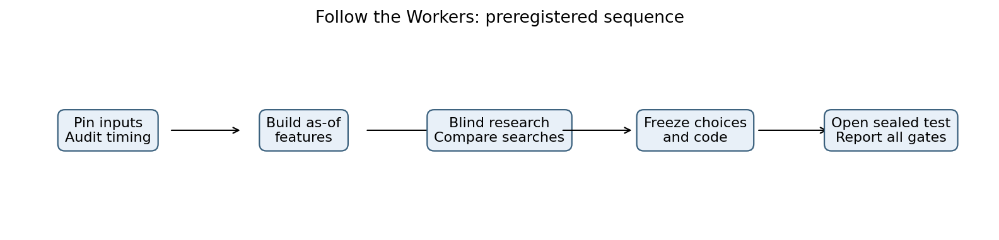

Prespecified sequence. All readiness checks passed before the sealed opening. [PDF](../outputs/figures/01_pipeline.pdf)

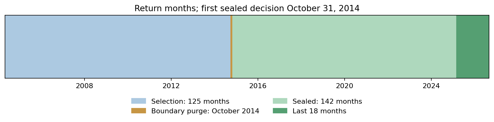

October 2014 is purged from selection; the sealed sample contains 142 return months. [PDF](../outputs/figures/02_sample_split.pdf)

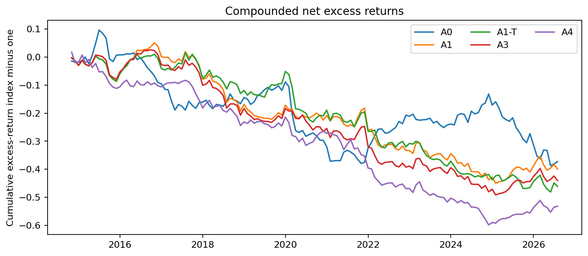

Compounded net excess-return index, not funded account wealth. [PDF](../outputs/figures/03_cumulative_net.pdf)

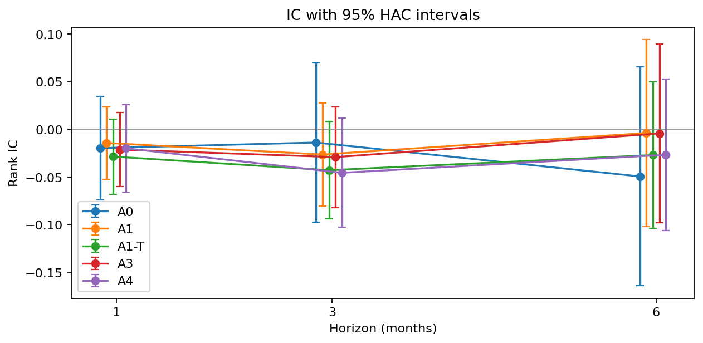

HAC uncertainty intervals; sample sizes are 142, 140 and 137 for one-, three- and six-month horizons. [PDF](../outputs/figures/04_ic_horizons.pdf)

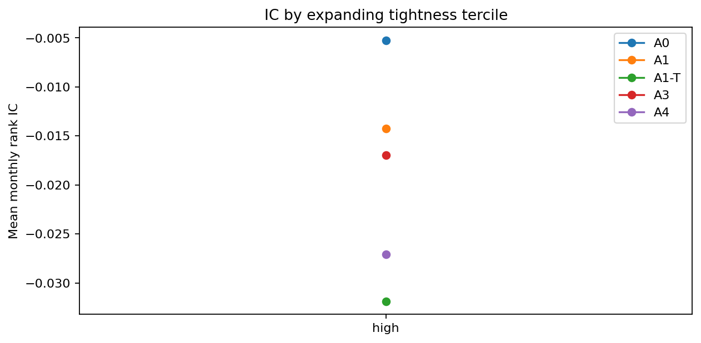

Expanding historical terciles, not equal-sized sealed bins: low n=3 and middle n=6 have unavailable HAC IC estimates; high n=133 is plotted. [PDF](../outputs/figures/05_ic_tightness.pdf)

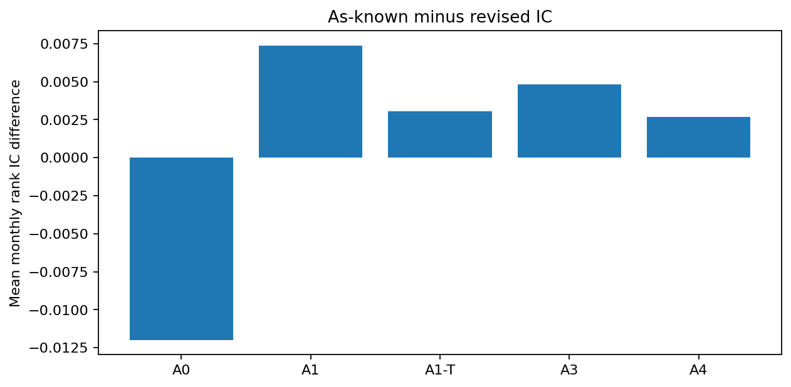

As-known minus revised-data mean IC. No variant was selected using this comparison. [PDF](../outputs/figures/06_revision_gap.pdf)

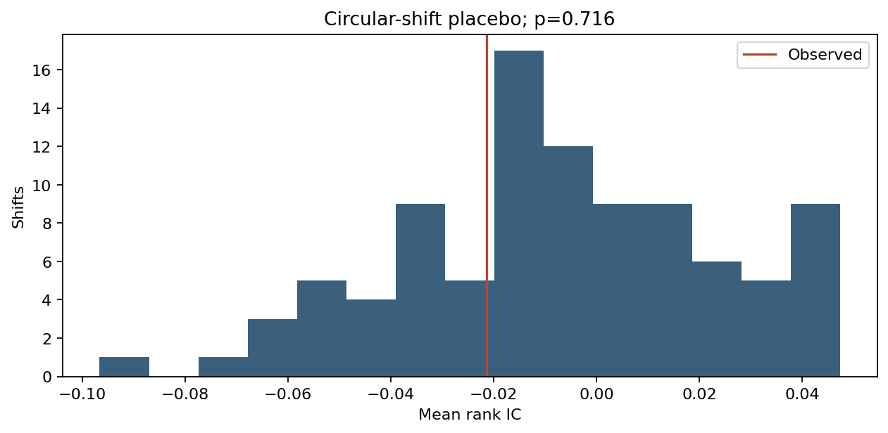

The registered 95 circular shifts refit the frozen algorithm causally; p=0.716. [PDF](../outputs/figures/07_placebo.pdf)

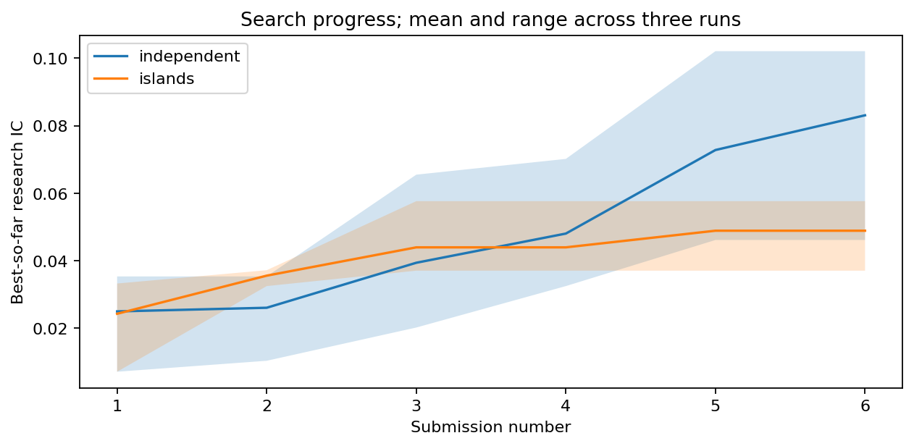

Means and ranges across three search repetitions. They are not independent sealed tests. [PDF](../outputs/figures/08_search_progress.pdf)

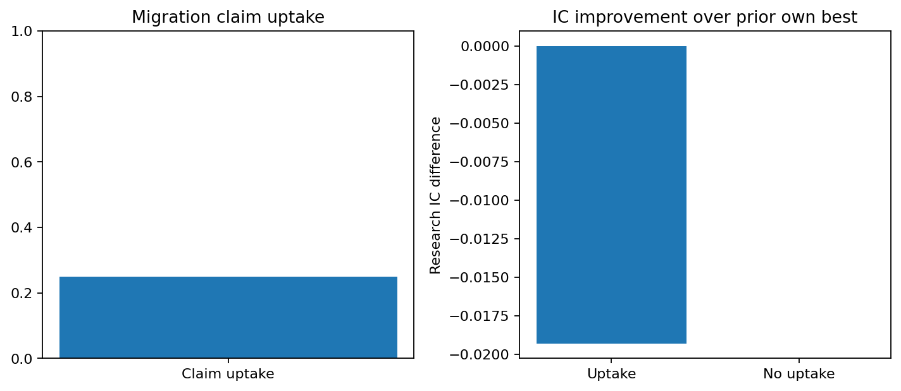

Only 8/36 automated uptake labels are defined; uptake=2/8. Other 28 labels are missing. Score differences are descriptive associations, with severe missingness and no causal interpretation. [PDF](../outputs/figures/09_migration.pdf)

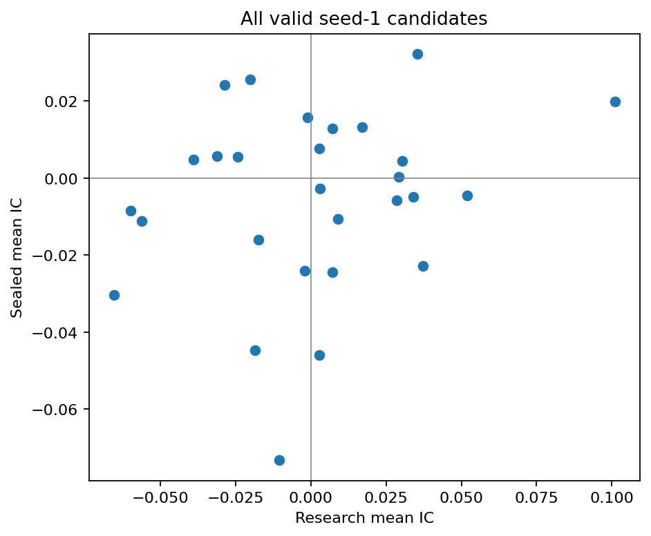

Every valid first-repetition candidate, regardless of selection or performance. [PDF](../outputs/figures/10_research_sealed.pdf)

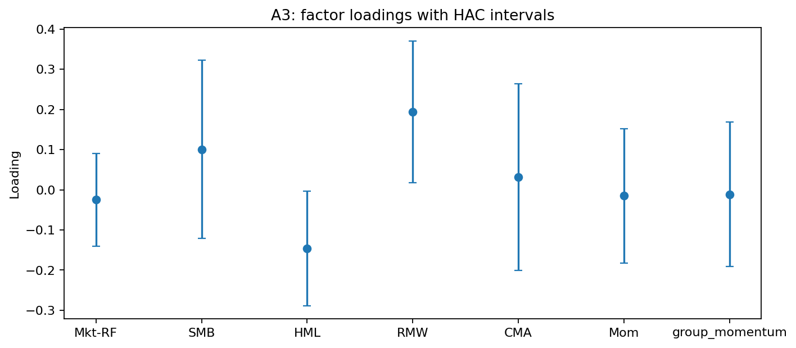

Primary A3 factor loadings with HAC uncertainty intervals. [PDF](../outputs/figures/11_factor_loadings.pdf)

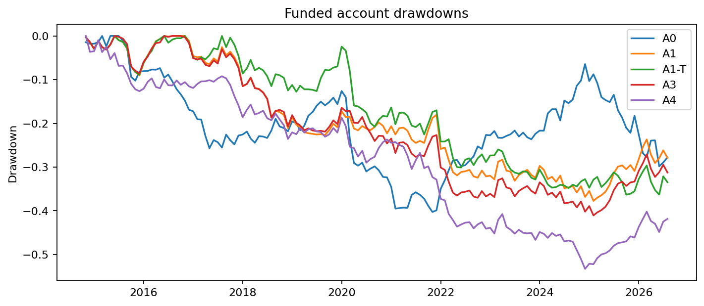

Drawdowns of funded account wealth, including the risk-free component. [PDF](../outputs/figures/12_drawdowns.pdf)
