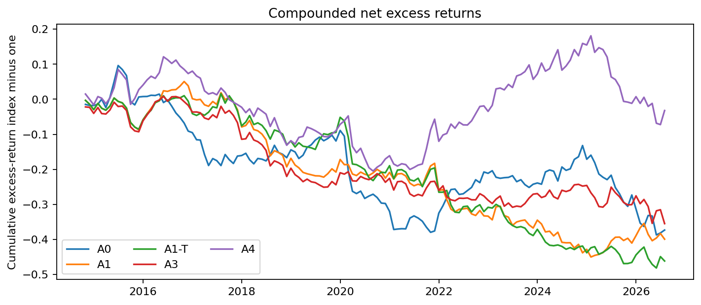
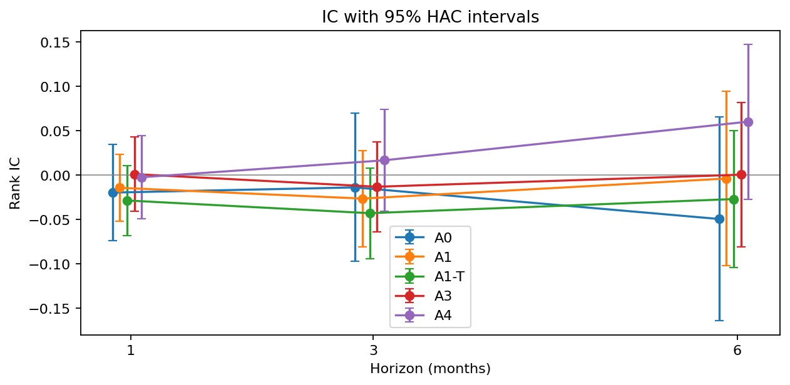
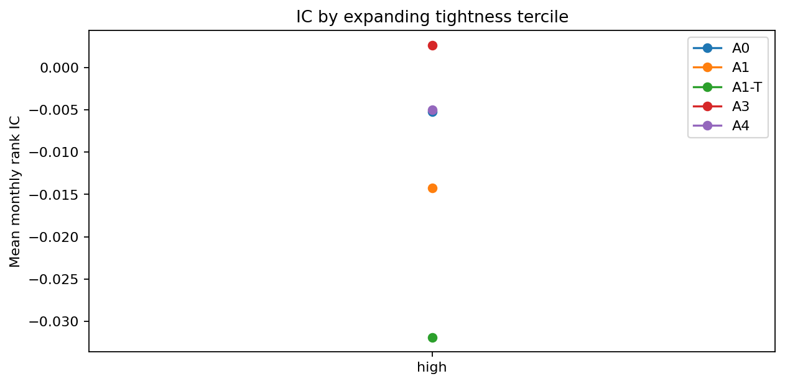
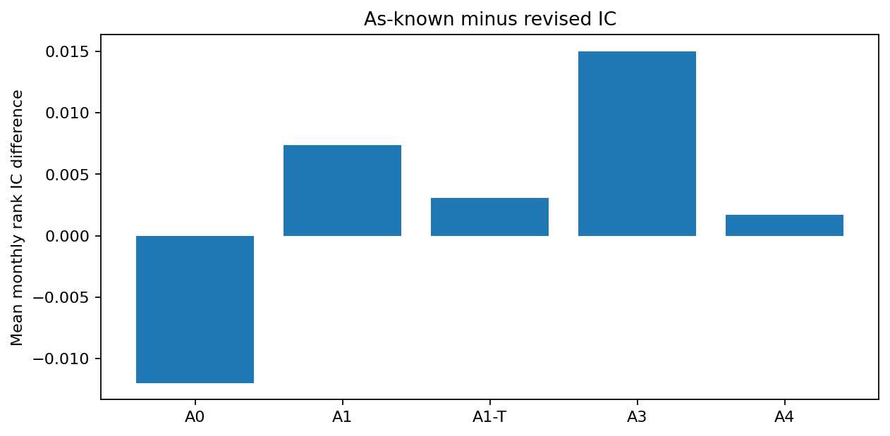
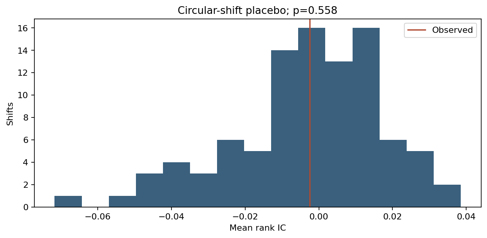
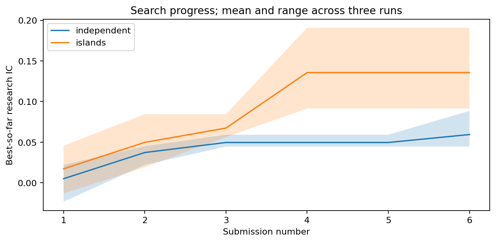
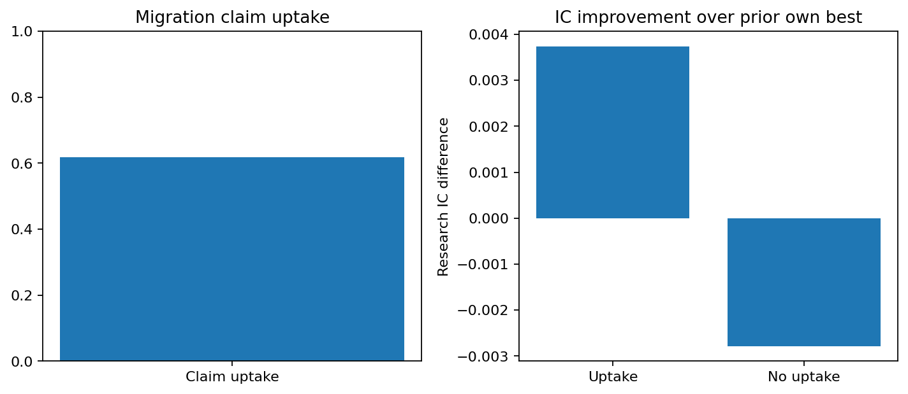
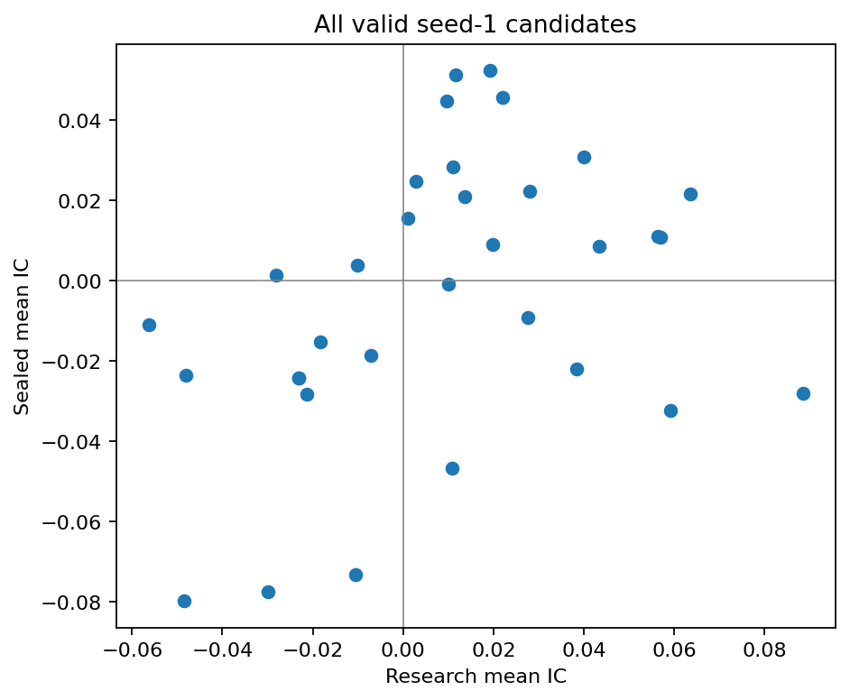
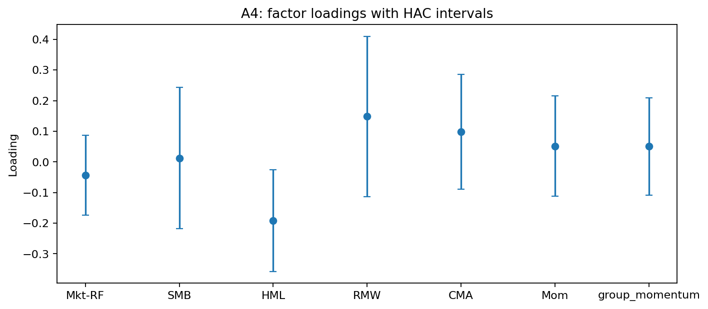
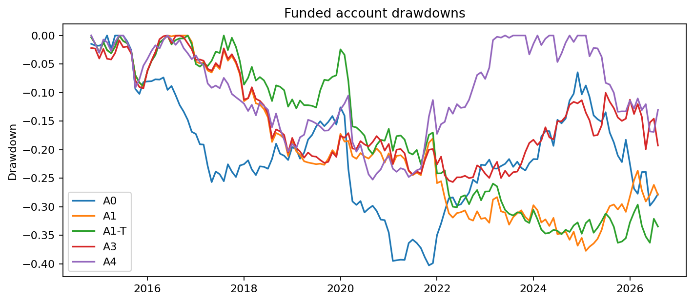

# Follow the Workers

## 1. Executive summary

**Exploratory follow-up.** The user requested Opus 5.5 at extra-high effort after seeing the original Sonnet study's test results. New agents received no earlier proposals, feedback, reports or outcomes. The historical period itself is already exposed to the user and engineer, so this is not a new untouched holdout. The word sealed below refers to the access restriction within this run. Both studies remain reported.

The comparison changes model and effort together and includes two disclosed preflight corrections: explicit bare-JSON/type instructions and a narrow statistical-language screen correction. It does not isolate the causal effect of model capability. Economic inputs, October timing, search budgets, costs, selection and inference rules remain fixed. No study source changed after launch.

**Follow-up result: Do not implement.** Research selected A4. On the 142-month historical test, November 2014 through August 2026, it earned 0.07% annualized mean net excess return, Sharpe 0.01, and -25.25% maximum funded drawdown. Failed registered criteria: G2, G3, G4, G5. The annualized mean is twelve times the monthly arithmetic mean, not CAGR.

142 test months require roughly 0.6 annualized Sharpe for IID t≈2; a null does not rule out a smaller effect. This study separates public labor prediction, optional company data, and agent search behavior.

## 2. What did you try

### 2a. Ideas

Predict next-month relative returns across 13 fixed industry groups using public labor changes. Compare independent and communicating agent searches with equal budgets; only seed 1 supplies strategy features.

### 2b. Data

FRED/ALFRED labor vintages and Ken French industry returns and factors, pinned by file hash. Research uses the October 30, 2014 snapshot with fixed publication lags. Sealed results use information available before each decision. Selection ends September 2014; October is purged. LinkUp and WARN failed timing/evidence gates and are excluded. F6 and A5 are omitted; Q2 cannot be answered with these inputs. See [the source manifest](../../outputs/manifest.csv) and [deviations](../../outputs/deviations.md).

### 2c. Implementation

Expanding ridge fits require 36 fully available training months. Penalties are fixed using five chronological folds with a one-month purge. Portfolios rank the top and bottom three, average three monthly tranches, hedge lagged market beta, target 10% volatility and cap gross exposure at 2. Costs use drift-adjusted one-way turnover; industry trades cost 10 bp and market-hedge trades 2 bp. The registered volatility target and leverage cap also apply during startup.

The target is an industry's excess return less the equal-weight mean excess return of the fixed group universe. This focuses the prediction exercise on relative performance. National tightness is common to every group and cannot change a cross-sectional ranking on its own; it enters the interaction comparator, while the main public model answers the primary labor-information question. The fixed benchmark averages standardized openings, hires, negative layoffs and hours with signs specified before observing results.

Each industry return combines its assigned French portfolios using prior-month market capitalizations, computed as number of firms times average firm size. Missing required members or factors cause a validation failure rather than a smaller, changing universe. The French files are current historical research series. Their use does not establish point-in-time constituent availability or the tradability of an identical basket. Exact source bytes and observation endpoints are retained in the input inventory.

The labor pipeline distinguishes reference months from publication dates. A value observed for an earlier month is not usable merely because its reference month precedes the portfolio decision. ASOF uses the vintage interval in force by the previous calendar day. FIRST keeps the earliest archived vintage, which is not necessarily the original release for observations predating archive coverage. REVISED is a hindsight diagnostic and FIXEDLAG applies publication lags to revised values. Research history uses a single frozen snapshot with fixed lags, so it is explicitly pseudo-real-time. No later revision enters that research snapshot. National openings and unemployment use the latest jointly available reference month, with staleness recorded. Construction earnings use the prescribed seasonally adjusted exception, explicitly flagged in the manifest.

Public signals compare three-month averages with their year-earlier counterparts; hours use log growth. Each signal is divided by its own expanding historical standard deviation, then standardized across groups and winsorized. Insufficient current coverage does not become an apparently valid all-zero signal. Permitted missing groups are flagged before imputation. Shared series and broad supersector matches reduce the effective diversity of the information, even when the portfolio has distinct return columns.

Training labels obey the same timing rule as predictors. For a return earned in month m, the decision is at the previous month-end and the most recent fully available monthly return is m minus two. The October boundary return therefore cannot choose the first sealed portfolio's model, and the same restriction applies to its risk estimates. Cross-validation keeps entire months together and uses chronological training followed by purged validation blocks. Penalties and selected feature definitions remain fixed in the sealed test, while coefficients update using newly available historical labels.

Agent leaves are decision-time levels, evaluated privately; agents receive their anonymous dictionary, permitted operations and rounded development summaries. Temporal operators retain the information known at each previous decision rather than retrospectively revising the feature history. A whitelist parser rejects arbitrary code, arithmetic outside the grammar, negative lags and excess depth or variable counts. Constructed candidates receive the registered standardization. Missing candidate model inputs are zero-imputed with coverage reported separately; undefined candidate IC is never presented as zero.

Both search architectures receive equal submission budgets and starting emphases. Migration occurs only after all participating islands finish the designated submission, preventing an ordering advantage within a round. Invalid submissions consume their slots. Syntax repair is limited and is distinct from revising an invalid hypothesis. Only the first seed can contribute selected features; the remaining seeds characterize search variation. The engineer does not propose, manually edit or rank experimental candidates.

Portfolio membership stays fixed within each tranche. Each month's target combines the remaining tranches, estimates group market betas from prior returns, adds a market hedge and uses a joint covariance estimate for risk scaling. Both hedge exposure and industry exposure count toward the gross cap. Empty startup or abstention slots contribute zero tranches; the aggregate book is scaled to the registered volatility target subject to the leverage cap. If tranches cancel, the book can become flat and pays any required liquidation costs. Weight drift uses funded account returns, while performance Sharpe uses net excess returns.

Transaction charges are applied once to absolute changes from drifted pretrade weights. Industry and hedge rates are distinct, and borrow/financing sensitivities are reported separately. Candidate portfolio diagnostics use the common research comparison calendar; missing or constant signals create no new tranche while existing holdings age normally. The long-only comparator uses the same top-group membership against an equal-weight group benchmark. Its active return, tracking error and information ratio supplement the long–short results.

Monthly IC inference uses calendar-aware Newey–West errors. Overlapping horizons compound total returns before cross-sectional demeaning, with longer HAC lags. Paired comparisons resample the same calendar positions and center the null distribution; the prespecified inferential endpoints share a Holm adjustment. The reality-check diagnostic preserves the joint IC/missingness calendar, and unavailable full-family calculations are reported explicitly. Deflated Sharpe uses monthly units and the nominal search budget; neither diagnostic completely removes dependence or adaptive-search bias.

Before opening sealed returns, feature choices, code, inputs, review evidence and the implementation-capacity assessment are hashed. A start marker precedes the sealed read. Any later rerun needs a written reason and a separate output directory. Readiness rejects stale audit stamps whose underlying files changed. The notebook source is protected independently of execution outputs, while append-only operational logs remain available to document the run.

## 3. What did you learn

### 3a. Style and risk exposures

| Strategy | Research Sharpe | Sealed Sharpe | Sealed IC | HAC t |
|---|---:|---:|---:|---:|
| A0 | -0.441 | -0.359 | -0.020 | -0.713 |
| A1 | -0.541 | -0.507 | -0.014 | -0.743 |
| A1-T | -0.548 | -0.593 | -0.029 | -1.422 |
| A3 | -0.482 | -0.456 | 0.001 | 0.048 |
| A4 | -0.403 | 0.009 | -0.002 | -0.103 |

Primary factor alpha: 0.0092% per month; HAC t: 0.052. See the saved factor table and figure.

### 3b. Time patterns

The results file contains whole-period, half-period, pandemic-excluded, last-18-month and expanding-tightness-tercile results. Course-window series combine pseudo-real-time research and as-known sealed data and are descriptive.

| Primary window | Months | Net Sharpe | Mean IC | HAC t |
|---|---:|---:|---:|---:|
| whole | 142 | 0.009 | -0.002 | -0.103 |
| first_half | 71 | -0.451 | -0.034 | -1.075 |
| second_half | 71 | 0.423 | 0.029 | 0.865 |
| ex_pandemic | 132 | 0.143 | -0.001 | -0.034 |
| last_18 | 18 | -1.410 | -0.067 | -1.673 |
| T_low | 3 | -7.629 | unavailable | unavailable |
| T_middle | 6 | 0.607 | unavailable | unavailable |
| T_high | 133 | 0.072 | -0.005 | -0.198 |
| VU_below_1 | 67 | -0.466 | -0.022 | -0.607 |
| VU_above_1 | 75 | 0.341 | 0.015 | 0.468 |

Funded drawdown is not computed for disconnected conditional months: concatenating isolated regimes would not describe a continuous account. The full and post-2010 windows state their actual first observation after model burn-in. Their research segment is descriptive because the same research sample supplied model choices. It is not additional sealed evidence.

### 3c. Robustness and limits

Effective cross-sectional width is approximately 8–9 because some groups share CES series or use approximate supersectors. Tightness interactions and A4 versus A3 are descriptive. Company-data exclusion limits the study to Q1 and Q3. Research bootstrap and DSR diagnostics cannot fully correct adaptive model search. French industry portfolios are research series, not directly tradable. NAICS-based CRSP stock baskets are the recommended follow-up. ETF proxies require verified mapping and capacity analysis before trading.

Primary placebo p: 0.558. Fixed-path industry-cost breakeven: 10.667 bp. All prespecified sensitivity values, candidate failures, Holm-adjusted comparisons and exclusion reasons remain in the output files regardless of sign.

| Primary sensitivity | Net Sharpe | Mean turnover |
|---|---:|---:|
| holding_1 | -0.350 | 2.010 |
| holding_6 | 0.275 | 0.586 |
| cost_0 | 0.143 | 0.936 |
| cost_25 | -0.193 | 0.937 |
| borrow_25 | -0.020 | 0.937 |

Candidates that passed research eligibility but failed the sealed predictive criterion: 6. The saved definition requires the research t/correlation/half-sample filter and checks sealed t plus positive IC in each half; it does not reselect features on test outcomes. Every original seed-1 slot remains accounted for, including invalid proposals.

All four prespecified inferential comparisons remain nonsignificant after Holm adjustment (smallest adjusted p = 0.801). The descriptive A4-minus-A3 monthly net-return difference is 0.291 percentage points, with a 95% bootstrap interval from -0.110 to 0.682 percentage points, which includes zero. This does not establish a communication advantage.

The primary strategy fails the prediction criterion (next-month IC -0.0025; HAC t -0.10) and alpha criterion (HAC t 0.05). Its IC changes sign between test halves, the placebo p is 0.558, and the largest group contribution is 30.8 times total net profit, inflated by the near-zero total profit. It also fails the implementation criterion: Sharpe falls to -0.19 at 25 bp industry costs, and capacity remains unverified.

Circular-shift tests refit the frozen algorithm causally under every registered displacement. They do not merely shift already-fitted predictions. Drop-one-group diagnostics recompute cross-sectional transforms, target ranks, coefficients and portfolio risk while retaining the selected specifications and penalties. Revised-data comparisons measure the difference between available information and hindsight. These checks expose sensitivity; passing them does not prove an executable trading edge.

### 3d. AI evaluation

The experimental researchers, migration judges and P1/P4 reviewers use Claude Opus 5.5 (extra-high) through a subscription. The user approved this all-Opus follow-up after seeing the earlier test results; the provider amendment and actual interaction evidence are retained. Run indices 1–3 label independent repetitions; the CLI does not honor requested model seeds or temperature. Only run 1 supplies strategy features. Agents saw tightness-tercile feedback but never half-sample IC. Study calls receive no calendar dates or project context; the verified transport removes the CLI’s injected environment reminders.

Migration reports admitted: 15 of 18. Only admitted reports were delivered. Report rejection and undefined judgments are recorded separately.

| Search metric | Independent mean | Islands mean | Islands minus independent | Absolute gap exceeds seed range? |
|---|---:|---:|---:|---|
| best_so_far_ic | 0.059 | 0.136 | 0.076 | False |
| median_ic | -0.004 | 0.027 | 0.031 | False |
| invalid_rate | 0.000 | 0.037 | 0.037 | False |
| diversity | 0.776 | 0.754 | -0.022 | False |

These comparisons describe the search process. Claim uptake is evaluated per report–receiving-submission pair; a later hypothesis can be associated with several earlier reports. Improvements over a receiving agent’s earlier best are therefore descriptive associations, not causal estimates of communication. Failure avoidance and the sampled human agreement are retained separately. Students must critically assess the proposals and audit findings rather than treating a syntactically valid response as economic evidence.

## 4. Appendices

All reported results originate in saved research_summary.json, agent summary files or sealed results.json. Full code, input hashes, inference tables, frozen selections, call logs and figure hashes accompany this report. Team critique remains for the students.

### Selected feature interpretation, decoded after evaluation

- independent, independent_1_Interactions_6: `mult(regime(tsz(HIR,"exp"),"high"),csrank(tsz(JOR,"exp")))`. In high-T regimes, a group's V02 elevation versus own history predicts higher next-month relative returns, amplified when its V06 is also elevated versus own history relative to peers; interaction should exceed V02 alone.
- islands, islands_1_Composition_4: `regime(spread(chg(QUR,3),chg(HIR,3)),"low")`. Relative shifts from V02 toward V03 flow predict higher next-month relative returns mainly when the common index is low. Restricting the signal to low-T regimes should strengthen its information coefficient versus the unconditional version.
- islands, islands_1_Temporal_4: `tsz(lchg(lag(E,1),12),36)`. Groups whose twelve-month log growth in hourly pay (V05), lagged one month, is unusually high versus its own 36-month history experience demand strength that markets underprice, producing higher next-month relative returns.
- islands, islands_1_Temporal_6: `tsz(lchg(lag(H,1),12),36)`. Testing whether submission four's own-history effect generalizes: groups whose twelve-month log growth in average hours (V01), lagged one month, is unusually high versus its own 36-month history outperform peers next month.

### A. Comparison with the preserved original study

| Strategy | Original Sonnet test Sharpe | Opus follow-up test Sharpe | Difference |
|---|---|---|---|
| A0 | -0.359 | -0.359 | 0.000 |
| A1 | -0.507 | -0.507 | 0.000 |
| A1-T | -0.593 | -0.593 | 0.000 |
| A3 | -0.584 | -0.456 | 0.129 |
| A4 | -0.786 | 0.009 | 0.795 |

The original primary was A3; the follow-up primary is A4, chosen using research data only. These differences are descriptive. Selecting which run to emphasize using this test would add another selection step. [Original report](../../../follow_the_workers/report/report.md).

The follow-up selected 1 independent-arm feature and 3 island-arm features, using 88 common research prediction months. The research primary Sharpe was -0.403.

| Strategy | Net mean/year | Volatility/year | Max funded drawdown | Industry turnover/month | Long-only active/year | Tracking error | Information ratio |
|---|---|---|---|---|---|---|---|
| A0 | -3.47% | 9.66% | -40.28% | 0.832 | -1.42% | 6.08% | -0.233 |
| A1 | -3.99% | 7.86% | -37.74% | 0.910 | -2.35% | 5.33% | -0.441 |
| A1-T | -4.88% | 8.22% | -36.32% | 0.890 | -3.33% | 5.24% | -0.636 |
| A3 | -3.42% | 7.50% | -25.67% | 0.955 | -2.71% | 4.95% | -0.547 |
| A4 | 0.07% | 8.37% | -25.25% | 0.936 | -1.05% | 4.47% | -0.235 |

The primary next-month IC is -0.0025 (HAC t=-0.10); monthly factor alpha is 0.01% (HAC t=0.05). Circular-shift placebo p=0.558. At 25 bp industry trading costs, primary Sharpe is -0.19. Registered sensitivities remain diagnostics; no favorable holding period, data variant or model is promoted after testing.

### B. Instruction following and human review

106/108 proposals passed validation. 15/18 reports were admitted. 84/88 uptake labels are defined; automated uptake among defined labels is 61.90%. Rejected attempts remain in the fixed budget.

The human checked 17 fixed sampled pairs. There are 17 comparable human/machine labels, with 10 agreements (58.8%). Undefined machine labels are reported separately and are not counted as substantive disagreements. Uptake means using or testing a claim, not that the claim or proposal is correct. Shared variables or vocabulary alone are insufficient.

[Human submission](../../outputs/human_review_submission.json) · [All judgments](../../outputs/agents/migration_judgments.json) · [Migration summary](../../outputs/agents/migration_summary.json).

The user marked 3/17 pairs yes, while the automated judge marked 10/17 yes. All seven disagreements were automated yes/human no, on items 2, 3, 8, 12, 13, 16 and 17. The submitted no labels for items 8, 16 and 17 retain their ambiguity notes. The user identified citations to findings from other reports and warned against matching on vocabulary. Some disputed cases involve adopting a methodological suggestion or misreading a premise; the human standard requires use of a specific reported result. These definition differences and the small dependent sample limit interpretation. Well-formed JSON therefore does not establish reliable attribution, and the full automated uptake rate must be treated cautiously. [Full submitted rationales](../../outputs/human_review_submission.md).

- islands_1_Composition_5: Standalone Information group-name screen matched relative-return information in a statistical hypothesis; this is a lexical false positive, not an observed identity leak. Preserve invalid slot and raw response. No source, prompt, candidate or budget change during study. Disclose rejection and resulting missing candidate in final report.
- islands_3_Temporal_2: Standalone Information group-name screen matched adding information beyond in a statistical hypothesis; this is a lexical false positive, not an observed identity leak. Preserve invalid slot and raw response. No source, prompt, candidate or budget change during study. Disclose this as screening failure rather than economic-reasoning failure.
- islands_3_Composition_2_migration: Standalone Information group-name screen matched timely information in a statistical report; this is a lexical false positive, not an observed identity leak. Preserve rejected report and raw response; no delivery, replacement call or mid-study screen change. Disclose this as an implementation limitation, separately from genuine word-limit violations.
- islands_3_Temporal_4_migration: The report includes a Failures heading, a rejected submission, and an attempt that disappointed with low coverage and negative conditional correlation. The keyword check matches singular failure and specific verbs, but misses plural Failures, rejected and disappointed. This is a semantic-admission false negative. Preserve rejected report/raw response and current budget; no late delivery, replacement call, parsing rescue or mid-study source change. Disclose as screening error rather than absence of a reported unsuccessful finding.

The 36-slot research reality-check result is unavailable. Full family contains an invalid/all-missing trial or has fewer than two months The full declared family and missing trials remain recorded; no invalid slot is silently removed to obtain a p-value.

### C. Audit evidence and reproducibility

- [Design and amendments](../../outputs/followup_design.json)
- [P1 findings](../../outputs/p1_review.md)
- [P4 decisions](../../outputs/p4_review.md)
- [Frozen inventory](../../outputs/FREEZE.json)
- [Complete saved results](../../outputs/sealed/initial/results.json)

The fixed-data limitations persist: approximate sector correspondence, shared source series, snapshot-based research history and limited research prediction months. Company-level sources failed admission, so Q2 remains unanswered. Trading capacity is unverified. A stronger language model does not resolve these data limitations.

**P1: source/code audit.** [Full prompt and context](../../outputs/p1_request.json)

> Find mapping errors, timestamp or look-ahead errors, and code bugs in the material below.
> For each problem, give the exact line or row, why it is wrong, and a test that would confirm it.
> Do not report style issues.

**P2: anonymous hypothesis generation.** [Full prompt and context](../../outputs/agents/log.jsonl)

> You are a quantitative researcher. You will propose one feature per turn to predict which of 13 anonymous groups (G01 to G13) will have higher returns next month relative to the others. You see only the variable dictionary below, the allowed operations, and summary statistics of your previous submissions. You do not know what the groups, variables or time periods are. Do not guess them and do not use knowledge about any real industry, company or date.

**P4: research red team.** [Full prompt and context](../../outputs/p4_request.json)

> Give 10 distinct reasons these results could be spurious, ranked by likelihood.
> For each, name a test that can be run with this data and the result that would make us say "do not implement".

### D. Registered figures

Registered workflow; this follow-up reuses a previously evaluated historical period. [PDF](../../outputs/figures/01_pipeline.pdf).

Approved October purge and fixed research/test dates. [PDF](../../outputs/figures/02_sample_split.pdf).

Compounded net excess returns, distinct from funded account wealth. [PDF](../../outputs/figures/03_cumulative_net.pdf).

Rank prediction correlations with HAC uncertainty. [PDF](../../outputs/figures/04_ic_horizons.pdf).

Historical expanding tightness bins. Low and middle bins contain only 3 and 6 months, so their IC estimates are unavailable under the registered minimum sample rule and omitted from the plot; their short-window Sharpe estimates are unstable. [PDF](../../outputs/figures/05_ic_tightness.pdf).

As-known versus revised-data prediction; no variant selected using this result. [PDF](../../outputs/figures/06_revision_gap.pdf).

Registered circular shifts with causal algorithm refits. [PDF](../../outputs/figures/07_placebo.pdf).

Search means and ranges across three repetitions, not independent test samples. [PDF](../../outputs/figures/08_search_progress.pdf).

Automated claim-uptake associations, not human-validated uptake. The judge marked 10/17 sampled pairs yes versus the human’s 3/17. This disagreement limits interpretation of both bars. [PDF](../../outputs/figures/09_migration.pdf).

Research and test results for valid first-repetition candidates. [PDF](../../outputs/figures/10_research_sealed.pdf).

Research-selected primary factor exposures with HAC uncertainty. [PDF](../../outputs/figures/11_factor_loadings.pdf).

Drawdowns of funded account wealth. [PDF](../../outputs/figures/12_drawdowns.pdf).
