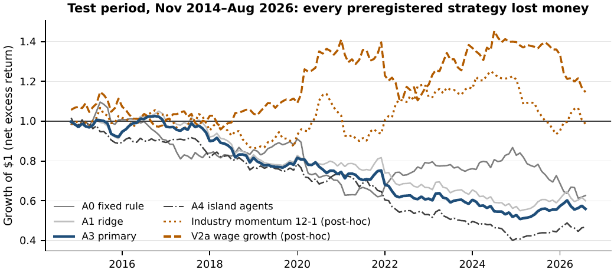
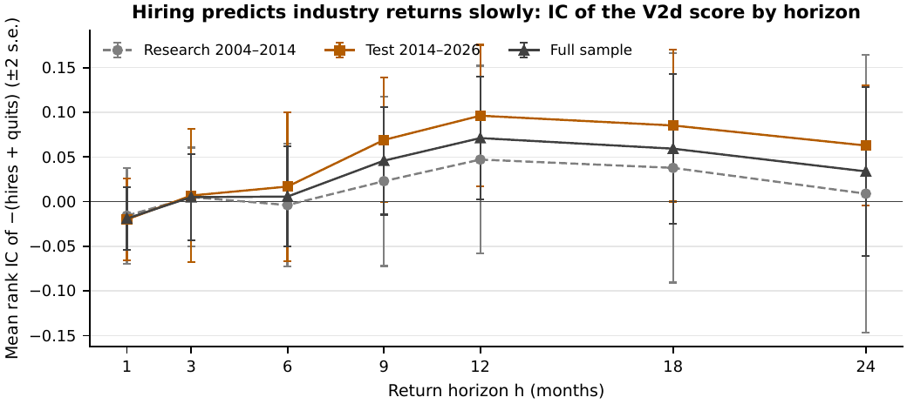
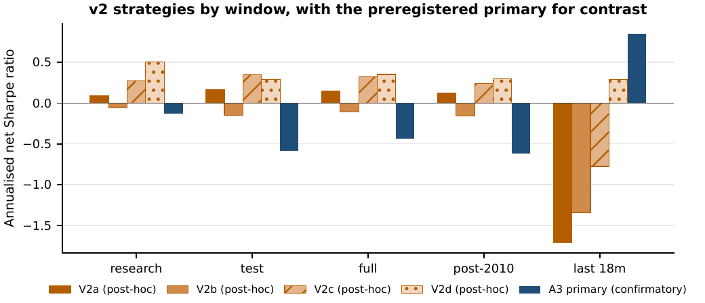
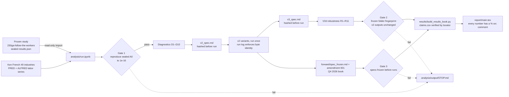

# Follow the Workers: do labor-market flows predict industry returns?

**MFE 230GA, Active Equity Management, UC Berkeley Haas, Fall 2026. Final project.**
Romain Almeida · Elouan Bahri · Al Yazid Bensaid · Piero Pelosi · Alex Roesler

Report: [`report/main.pdf`](report/main.pdf) · Results Book: [`results/results_book.pdf`](results/results_book.pdf) · Verdict: [`results/VERDICT.md`](results/VERDICT.md) · Every number with its source: [`results/claims.csv`](results/claims.csv)

## The answer in five lines

1. **H1, demand channel (preregistered, tested once): rejected.** Ranking 13 industry groups on the year-over-year change in openings, hires, layoffs and hours, as known at the time, lost 4.6% a year after costs over 142 untouched months (Sharpe −0.58, IC −0.021, placebo p 0.72). *Do not implement.*
2. **Why it failed:** two of the four preregistered signs (layoffs, hours) have the opposite sign in the data; the one stable one-month signal, wage growth, was dropped during the build; and the labor market never tightened in the research years, so the tightness moderator (H3) could not be tested.
3. **H2, cost and investment channel (post hoc): consistent with the data, not established.** Industries that hire and lose workers fastest earn lower returns over the following 9 to 24 months. A 12-month book on that sign (V2d) is positive in every window (test Sharpe +0.29, 12-month IC +0.096, t 2.43) but was designed after the test was opened, lost money in the first test half and has a deflated Sharpe of 0.05 after 132 looks.
4. **Forward test:** four paper books, frozen on 3 October 2026 for the 30 September decision and held to 31 December, with no capital behind them (`analysis/forward/`).
5. **Claude as research assistant:** useful auditor and idea generator when a human checked every claim against the code and data and it could not change the rules after seeing results; all 25 P1 findings, 10 P4 concerns and 25 judge labels needed that check.

## Scoreboard

Net Sharpe ratios after 10 bp industry costs and 2 bp hedge costs, annualised. Source: [`results/scoreboard.csv`](results/scoreboard.csv), built by `results/build_results_book.py` from the frozen `results.json` and `analysis/output/tables/`.

| Strategy | Label | Research | Test | Full | Last 18 m | IC (t) | DSR | Reading |
|---|---|---|---|---|---|---|---|---|
| A3 primary (Sonnet agents) | CONFIRMATORY | −0.13 | **−0.58** | −0.44 | +0.85 | −0.021 (−1.08) | 0.00 | Do not implement |
| A0 fixed rule | CONFIRMATORY | −0.44 | −0.36 | −0.48 | −1.56 | −0.020 (−0.71) | 0.00 | negative |
| A1 ridge | CONFIRMATORY | −0.54 | −0.51 | −0.52 | +0.73 | −0.014 (−0.74) | 0.00 | negative |
| A1-T tightness | CONFIRMATORY | −0.55 | −0.59 | −0.58 | −0.37 | −0.029 (−1.42) | 0.00 | negative |
| A4 islands | CONFIRMATORY | −0.18 | −0.79 | −0.56 | +1.23 | −0.020 (−0.86) | 0.00 | negative |
| A4 primary (Opus follow-up) | EXPLORATORY | −0.40 | +0.01 | −0.13 | −1.41 | −0.002 (−0.10) | 0.00 | fails G2–G5 |
| V2a wage growth (declared headline) | POST-HOC | +0.09 | +0.16 | +0.15 | −1.71 | +0.049 (+2.04) | 0.02 | noise after the looks taken |
| V2b signed composite | POST-HOC | −0.06 | −0.15 | −0.11 | −1.34 | +0.042 (+1.65) | 0.00 | noise after the looks taken |
| V2c wage + momentum | POST-HOC | +0.27 | +0.35 | +0.32 | −0.78 | +0.032 (+1.21) | 0.09 | momentum supplies the return |
| V2d −(hires + quits), 12-month hold | POST-HOC | +0.50 | +0.29 | +0.35 | +0.29 | +0.096 (+2.43)* | 0.06 | thesis result, fragile in time |

**Legend.** CONFIRMATORY: preregistered, frozen and hashed before the test period (Nov 2014–Aug 2026) was opened once. EXPLORATORY: the Opus follow-up, run after the test had been seen. POST-HOC: chosen on 3 Oct 2026 after the test was opened; specs were hashed before running and every variant is reported. DSR: deflated Sharpe ratio (Bailey and López de Prado), 41 nominal trials for the frozen study, 112 for v2. \*12-month IC; the one-month IC of V2d is −0.020.

|  |  |
|---|---|
| Every preregistered H1 book lost money in the test; the post-hoc wage-growth book gained until 2024 and gave much back. | The H2 score has no one-month IC and a positive IC from 9 to 24 months, peaking at 12 (post hoc). |



## Repository map

```
README.md                    this page
CLAUDE.md                    rules every agent and teammate follows here (frozen folder read-only, labels, provenance)
requirements.txt             Python packages (loose pins; recorded versions in the comment)
230ga-follow-the-workers/    Alex's frozen preregistered study, a git submodule pinned to c67c486. READ-ONLY.
analysis/                    our iteration: params.py, data.py, stats.py, plots.py, run.ipynb; frozen specs; forward test; outputs
results/                     claims register (claims.csv), scoreboard, Results Book (PDF + md), VERDICT.md
report/                      LaTeX report on the house template: main.tex, preamble.tex, refs.bib, figures/, tables/, code/
docs/                        FINDINGS_AND_PROPOSAL.md (diagnosis of the frozen study), blueprint.html, course/, img/,
                             team_inputs/ (teammates' drafts), process/ (prompts, brief, review rounds, HANDOFF, OPEN_ISSUES)
```

## Pipeline



## Reproduce

```bash
git clone --recurse-submodules <repo-url> follow-the-workers
cd follow-the-workers
python3 -m venv .venv && source .venv/bin/activate && pip install -r requirements.txt
# 1. numbers, tables, figures (about 35 s); stops with analysis/output/STOP.md if any gate fails
jupyter nbconvert --to notebook --execute --inplace analysis/run.ipynb
# 2. claims register, scoreboard, Results Book
python3 -B results/build_results_book.py && (cd results && latexmk -pdf results_book.tex)
# 3. report
(cd report && python3 -B check_sources.py && latexmk -pdf main.tex)
```

Gates, in the order the notebook runs them: **Gate 1** rebuilds the 13 group returns and the preregistered A0 signal and matches the frozen study's 50 saved ledgers to 1.5e-16; **Gate 3** checks that every spec hash matches its file and that each freeze timestamp precedes its first run; **Gate 2** checks that the frozen folder still has 3,067 files with fingerprint `eb109be9…` and that the v2 and v3 outputs are byte-identical to their first runs. A failed gate writes `analysis/output/STOP.md` and the notebook stops; nothing downstream is regenerated. Use `python3 -B` (or `PYTHONDONTWRITEBYTECODE=1`) so no `__pycache__` lands in the frozen folder.

## How the results are protected

| Artefact | SHA-256 (first 8) | Frozen (UTC, 3 Oct 2026) | First run | Commit |
|---|---|---|---|---|
| `analysis/v2_spec.md` (V2a–V2d, reading rule, 112 looks) | `ca658234` | 09:00:13 | 09:01:55 | `d76fbb3` |
| `analysis/forward/spec_frozen.md` | `735a8ffa` | 09:03:56 | book 09:17:55 | `45991d4` |
| `analysis/forward/spec_amendment_001.md` | `c76cde86` | 09:16:11 | book 09:17:55 | `96b828f` |
| `analysis/forward/book_2026Q4.csv` (first build) | `85727526` | 09:17:55 | | `9f4a50f` |
| `analysis/v3_spec.md` (R1–R11, 132 looks) | `312aef1d` | 09:52:27 | 09:53:32 | `8fd75ae` |
| Frozen study folder (3,067 files) | `eb109be9` | pinned at `c67c486` | checked every run | |

- The frozen study is never edited, rerun or retuned; its code is imported read-only and the sealed result (A3, Sharpe −0.58) stands.
- Every result carries exactly one label, CONFIRMATORY, POST-HOC or FORWARD TEST; post-hoc specs were written and hashed before they ran, every pre-declared variant is reported, and every look is counted in the deflated Sharpe ratio.
- `analysis/output/v2_run_log.md` and `v3_run_log.md` hold the hashes of the first run; later runs must reproduce them or the notebook stops.
- `results/claims.csv` is the only source the report may quote; each claim has a machine-readable locator and is re-verified on every build (100 of 100 verified). `report/check_sources.py` fails the build if a `% src:` comment swallows text.
- The forward test is evaluated once, on 31 December 2026, whatever it shows.

## AI use

Claude did every AI job, which this term's course allows; the switch from the ChatGPT template is logged as preregistration amendments 001 and 002 in the frozen study. Confirmatory study: Claude Sonnet 5.5 at medium effort, 199 logged calls (P1 audit, P2 blinded signal agents, P3 migration judge, P4 red team). Follow-up: Claude Opus 5.5 at extra-high effort, 294 calls. Post-mortem review and this iteration: Claude Code (Opus 5.5, then Fable 5.1) under `CLAUDE.md`; prompts in `docs/process/`. The engineering assistant that wrote the frozen pipeline is not documented in the repository (open item for Alex). The report's §3.4 and Appendix A evaluate what Claude got right and wrong.

## Data sources and terms

- **Ken French Data Library**: 49 value-weighted industry portfolios, five factors and momentum (CRSP build 202608). Free for academic and non-commercial use with attribution. `analysis/data/french/`.
- **BLS JOLTS and CES via FRED**: industry openings, hires, quits and layoffs rates (not seasonally adjusted), average weekly hours and hourly earnings; `JTSJOL` and `UNEMPLOY` for tightness. BLS data are U.S. government works in the public domain; FRED and ALFRED redistribute them under the St. Louis Fed terms of use. Current values in `analysis/data/fred/`, the 29 September 2026 vintage in `analysis/data/alfred_2026-09-29/`.
- The frozen study's own ALFRED vintage files sit inside the submodule and are not duplicated here.

## Team

| Who | Did |
|---|---|
| Alex Roesler, Romain Almeida, Piero Pelosi | idea |
| Elouan Bahri | data collection |
| Alex Roesler | v1 pipeline (the frozen preregistered study) |
| Piero Pelosi | v2 iteration and report v1 |
| Romain Almeida | report v2 |
| Al Yazid Bensaid | Claude evaluation |
| Elouan Bahri | references and data appendix |

Open items and who owns them: [`docs/process/HANDOFF.md`](docs/process/HANDOFF.md). Issues found but deliberately not fixed: [`docs/process/OPEN_ISSUES.md`](docs/process/OPEN_ISSUES.md).
