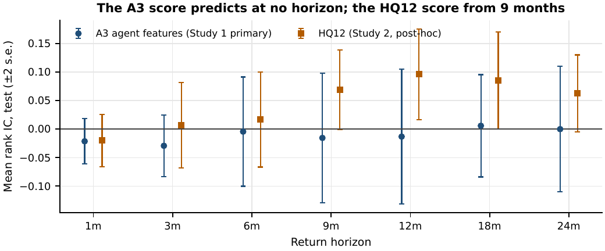
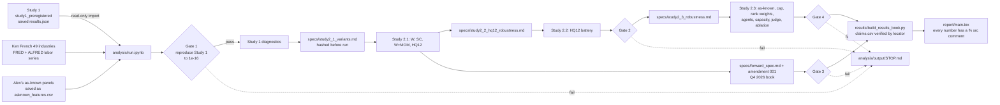

<div align="center">

# Follow the Workers

### Do labor-market flows predict which U.S. industries outperform?

**Piero Pelosi · Alex Roesler · Romain Almeida · Elouan Bahri · Al Yazid Bensaid**

MFE 230GA – Equity Markets · UC Berkeley Haas · Fall 2026 · Final project

[Report](report/main.pdf) · [Results Book](results/results_book.pdf) · [Verdict](results/VERDICT.md) · [Claims register](results/claims.csv)

</div>

---

## The answer in five lines

1. **Study 1 (preregistered, tested once): H1, the demand channel, is rejected.** Ranking 13 industry groups on the year-over-year change in openings, hires, layoffs and hours, as known at the time, lost 4.6% a year after costs over 142 untouched months (Sharpe −0.58, IC −0.021, placebo p 0.72). *Do not implement.*
2. **Why it failed:** two of the four preregistered signs (layoffs, hours) have the opposite sign in the data; the one stable one-month signal, wage growth, was dropped during the build; the labor market never tightened in the research years, so the tightness moderator could not be tested; and the AI-proposed features were switched off in almost every test month.
3. **Study 2 (post-hoc iteration): H2, the cost and investment channel, is consistent with the data, not established.** Industries that hire and lose workers fastest earn lower returns over the following 9 to 24 months. The 12-month book on that sign, HQ12, is positive in every window (test Sharpe +0.29; +0.20 on data as known at the time), but it was designed after the test was opened, lost money in the first test half and has a deflated Sharpe of 0.02 after 162 looks.
4. **Forward test:** four paper books, frozen on 3 October 2026 for the 30 September decision and held to 31 December, with no capital behind them ([analysis/output/forward/](analysis/output/forward/)).
5. **Claude as research assistant:** a useful auditor and idea generator when a human checked every claim and it could not change the rules after seeing results. A quote requirement fixed the judge's format but not its false positives, and a feedback ablation did not confirm our explanation for the agents' regime gates.

---

## Names

| Old name | Name used everywhere now |
|---|---|
| frozen / sealed / Sonnet study | **Study 1: preregistered (Alex)**, folder [study1_preregistered/](study1_preregistered/) |
| Opus follow-up | **Study 1b: exploratory follow-up (Opus)** |
| v2 / v3 / v4 runs | **Study 2: post-hoc iteration** (2.1 variants, 2.2 robustness of HQ12, 2.3 additional robustness) |
| A0, A1, A1-T, A3, A4 | A0 *fixed rule*, A1 *ridge*, A1-T *ridge × tightness*, A3 *agent features, independent* (primary), A4 *agent features, communicating* |
| V2a, V2b, V2c, V2d | **W** (wage growth, declared headline), **SC** (signed composite), **W+MOM** (wage growth + momentum), **HQ12** (hires + quits reversal, 12-month hold) |
| P1–P6 | P1 *data and code audit*, P2 *signal agents*, P3 *judge*, P4 *red team*, P5 *post-mortem review*, P6 *iteration* |

Result files written before the renaming keep the old codes inside, so they stay byte-identical; the hashed spec files do too.

---

## Every strategy we ran

Net Sharpe ratios after 10 bp industry costs and 2 bp hedge costs, annualised. Source: [results/scoreboard.csv](results/scoreboard.csv), built by [results/build_results_book.py](results/build_results_book.py) from Study 1's saved `results.json` and the tables under [analysis/output/](analysis/output/).

| Strategy | Label | Research | Test | Full | Last 18 m | IC (t) | DSR | Reading |
|---|---|---:|---:|---:|---:|---:|---:|---|
| **Study 1** A3 agent features, independent (primary) | CONFIRMATORY | −0.13 | **−0.58** | −0.44 | +0.85 | −0.021 (−1.08) | 0.00 | Do not implement |
| Study 1 A0 fixed rule | CONFIRMATORY | −0.44 | −0.36 | −0.48 | −1.56 | −0.020 (−0.71) | 0.00 | negative |
| Study 1 A1 ridge | CONFIRMATORY | −0.54 | −0.51 | −0.52 | +0.73 | −0.014 (−0.74) | 0.00 | negative |
| Study 1 A1-T ridge × tightness | CONFIRMATORY | −0.55 | −0.59 | −0.58 | −0.37 | −0.029 (−1.42) | 0.00 | negative |
| Study 1 A4 agent features, communicating | CONFIRMATORY | −0.18 | −0.79 | −0.56 | +1.23 | −0.020 (−0.86) | 0.00 | negative |
| **Study 1b** A4 (its primary) | EXPLORATORY | −0.40 | +0.01 | −0.13 | −1.41 | −0.002 (−0.10) | 0.00 | fails G2–G5 |
| **Study 2.1** W wage growth (declared headline) | POST-HOC | +0.09 | +0.16 | +0.15 | −1.71 | +0.049 (+2.04) | 0.02 | noise after the looks taken |
| Study 2.1 SC signed composite | POST-HOC | −0.06 | −0.15 | −0.11 | −1.34 | +0.042 (+1.65) | 0.00 | noise; sign flips as known |
| Study 2.1 W+MOM wage growth + momentum | POST-HOC | +0.27 | +0.35 | +0.32 | −0.78 | +0.032 (+1.21) | 0.09 | momentum supplies the return |
| Study 2.1 HQ12 hires + quits reversal, 12-month hold | POST-HOC | +0.50 | +0.29 | +0.35 | +0.29 | +0.096 (+2.43)\* | 0.06 | thesis result, fragile in time |
| **Study 2.3** HQ12 on as-known data | POST-HOC | +0.54 | +0.20 | +0.31 | +0.14 | +0.085 (+2.26)\* | 0.02 | as-known confirms the fixed-lag reading |
| Study 2.3 W / SC / W+MOM on as-known data (test) | POST-HOC | | +0.13 / +0.24 / +0.46 | | | | | see the Results Book |

**Legend.** CONFIRMATORY: preregistered, frozen and hashed before the test period (Nov 2014–Aug 2026) was opened once. EXPLORATORY: Study 1b, run after the test had been seen. POST-HOC: chosen after the test was opened; specs were hashed before running and every variant is reported. DSR: deflated Sharpe ratio; each row uses the looks taken when it was run (41 nominal trials for Study 1, 112 for Study 2.1, 162 for Study 2.3). \*12-month IC.

<p align="center"></p>
<p align="center"><em>Every Study 1 book lost money in the test; the post-hoc wage-growth book gained until 2024 and gave much of it back.</em></p>

<p align="center"></p>
<p align="center"><em>Horizon analysis, test window: the A3 score predicts at no horizon; the HQ12 score from 9 months (post hoc).</em></p>

<p align="center"></p>
<p align="center"><em>Only HQ12 is positive in every window; W and W+MOM lost heavily in the last 18 months.</em></p>

---

## Robustness in one table

| Question | Answer | Where |
|---|---|---|
| Is Study 1's loss robust? | Yes: negative under four data versions, three cost levels, both test halves, every dropped group, cap 2 / 3 / none and rank weights; bootstrap 90% interval [−0.99, −0.16] | [study1/robustness.md](analysis/output/study1/robustness.md) |
| Was Study 1 really frozen before the test? | The hash of the freeze file equals the one stored when the test was opened, 0.04 s later; 337 of 338 frozen files in the repository still match | same file |
| Does HQ12 survive data as known at the time? | Sign and most of the size: +0.20 against +0.29, 12-month IC +0.085 (t 2.26); the first test half is negative in both | [study2/robustness_2_3.md](analysis/output/study2/robustness_2_3.md) |
| Did the gross cap or the top-3 construction cause the losses? | No: lifting the cap restores volatility, not Sharpe; rank weights move A3 to −0.49 and HQ12 to +0.31 | same file |
| How many independent bets are 13 groups? | About 9 (participation ratio of relative returns) | same file |
| Capacity? | About $1 million with the proxy ETFs (the least liquid trades $3.2 million a day) | same file |
| Did sharing help the agents? | No: the arm gap is within the seed spread in both agent studies | same file |
| Does a quote requirement fix the LLM judge? | It fixes Sonnet's format (8 of 8 usable), not Opus's false yes (8 of 17) | same file |
| Did tightness feedback cause the regime gates? | Not confirmed: 4 of 48 proposals with the split, 3 of 50 without | same file |

---

## How the pipeline fits together



Study 1 is never edited, rerun or retuned; its code is imported read-only and its result (A3, Sharpe −0.58) stands. Every result carries exactly one label, CONFIRMATORY, POST-HOC or FORWARD TEST; post-hoc specs were written and hashed before they ran, every pre-declared variant is reported, and every look is counted in the deflated Sharpe ratio. [results/claims.csv](results/claims.csv) is the only source the report may quote; each claim has a machine-readable locator and is re-verified on every build (148 of 148 verified).

---

<details>
<summary><strong>Reproduce everything in three commands</strong></summary>

```bash
git clone https://github.com/pieropls/MFE230GA follow-the-workers
cd follow-the-workers
python3 -m venv .venv && source .venv/bin/activate && pip install -r requirements.txt
# 1. numbers, tables, figures (about one minute); stops with analysis/output/STOP.md if any gate fails
jupyter nbconvert --to notebook --execute --inplace analysis/run.ipynb
# 2. claims register, scoreboard, Results Book
python3 -B results/build_results_book.py && (cd results && latexmk -pdf results_book.tex)
# 3. report
(cd report && python3 -B check_sources.py && latexmk -pdf main.tex)
```

Gates, in the order the notebook runs them: **Gate 1** rebuilds the 13 group returns and Study 1's A0 signal and matches its 50 saved ledgers to 1.5e-16; **Gate 3** checks that every spec hash matches its file and that each freeze timestamp precedes its first run; **Gate 2** checks that the Study 1 folder still has 3,067 files with fingerprint `eb109be9…` and that the Study 2.1 and 2.2 outputs are byte-identical to their first runs; **Gate 4** does the same for Study 2.3 and checks that the variant backtest engine reproduces Study 1's backtest. A failed gate writes `analysis/output/STOP.md` and the notebook stops. Use `python3 -B` (or `PYTHONDONTWRITEBYTECODE=1`) so no `__pycache__` lands in the Study 1 folder. Byte identity is expected in the recorded environment ([analysis/output/environment.txt](analysis/output/environment.txt)).

Three inputs are read from saved files rather than recomputed: the as-known features (rebuilt from Alex's data package when it is present at `analysis/data/alex_package/`, otherwise read from [asknown_features.csv](analysis/output/study2/asknown_features.csv)), the ETF dollar volumes (Yahoo Finance, saved once) and the model calls of the judge and ablation tests ([analysis/llm_runs.py](analysis/llm_runs.py), logs under [analysis/output/study2/llm/](analysis/output/study2/llm/)).

</details>

<details>
<summary><strong>Repository map</strong></summary>

| Path | Contents |
|---|---|
| [README.md](README.md) | this page |
| [requirements.txt](requirements.txt) | Python packages (loose pins; recorded versions in the comment) |
| [study1_preregistered/](study1_preregistered/) | Study 1 and Study 1b: Alex's preregistered study, imported with his git history at `c67c486`. Read-only ([provenance](docs/frozen_provenance.md)) |
| [analysis/](analysis/) | Study 2: `params.py`, `data.py`, `stats.py`, `plots.py`, `run.ipynb`, `llm_runs.py` ([README](analysis/README.md)) |
| [analysis/specs/](analysis/specs/) | every frozen specification with its SHA-256: Study 2.1, 2.2, 2.3, the forward test and its amendment |
| [analysis/output/study1/](analysis/output/study1/) | Gate 1, the diagnostics of Study 1 and its robustness table |
| [analysis/output/study2/](analysis/output/study2/) | Study 2.1, 2.2 and 2.3 results, run logs, Gates 2 and 4, model-call logs |
| [analysis/output/forward/](analysis/output/forward/) | the Q4 2026 books, ETF proxies and Gate 3 |
| [results/](results/) | claims register, scoreboard, Results Book (PDF + markdown), verdict ([README](results/README.md)) |
| [report/](report/) | LaTeX report on the house template: `main.tex`, `preamble.tex`, `refs.bib`, `figures/`, `tables/`, `code/` |
| [docs/](docs/) | [diagnosis of Study 1](docs/FINDINGS_AND_PROPOSAL.md), [provenance](docs/frozen_provenance.md), [open issues](docs/OPEN_ISSUES.md), [commit map](docs/commit_map.md), [course sheet](docs/course/FinalProject.pdf), `img/` |

</details>

<details>
<summary><strong>How the results are protected: hashes, timestamps, commits</strong></summary>

| Artefact | SHA-256 (first 8) | Frozen (UTC) | First run | Commit |
|---|---|---|---|---|
| [specs/study2_1_variants.md](analysis/specs/study2_1_variants.md) (W, SC, W+MOM, HQ12; reading rule; 112 looks) | `ca658234` | 3 Oct, 09:00:13 | 09:01:55 | `44ae263` |
| [specs/forward_spec.md](analysis/specs/forward_spec.md) | `735a8ffa` | 3 Oct, 09:03:56 | book 09:17:55 | `f90b66c` |
| [specs/forward_amendment_001.md](analysis/specs/forward_amendment_001.md) | `c76cde86` | 3 Oct, 09:16:11 | book 09:17:55 | `22c67db` |
| [output/forward/book_2026Q4.csv](analysis/output/forward/book_2026Q4.csv) (first build) | `85727526` | 3 Oct, 09:17:55 | | `3e8ecd7` |
| [specs/study2_2_hq12_robustness.md](analysis/specs/study2_2_hq12_robustness.md) (132 looks) | `312aef1d` | 3 Oct, 09:52:27 | 09:53:32 | `c7014d9` |
| [specs/study2_3_robustness.md](analysis/specs/study2_3_robustness.md) (162 looks) | `068a3e03` | 4 Oct, 09:18:39 | 09:26:27 | `130b3a8` |
| Study 1 folder (3,067 files) | `eb109be9` | imported at `c67c486` with Alex's history | checked every run | [provenance](docs/frozen_provenance.md) |

- The run logs in [analysis/output/study2/](analysis/output/study2/) hold the hashes of every result table at its first run; later runs must reproduce them or the notebook stops.
- [report/check_sources.py](report/check_sources.py) fails the build if a `% src:` comment swallows text.
- The forward test is evaluated once, on 31 December 2026, whatever it shows.
- Issues found and deliberately not fixed, because fixing them would change a frozen file or a recorded result: [docs/OPEN_ISSUES.md](docs/OPEN_ISSUES.md).

</details>

---

## How we used Claude

Claude did every AI job, which this term's course allows; the switch from the ChatGPT template is logged as preregistration amendments 001 and 002 of Study 1. Study 1: Claude Sonnet 5.5 at medium effort, 199 logged calls (P1 data and code audit, P2 blinded signal agents, P3 judge, P4 red team). Study 1b: Claude Opus 5.5 at extra-high effort, 294 calls. The post-mortem review (P5) and this iteration (P6): Claude Code (Opus 5.5, then Fable 5.1) under a one-page rules file. Study 2.3 added 25 judge calls and 111 agent calls with the original model IDs, every one logged. Alex used a general-purpose coding assistant ("6 astra") for engineering support; it took no part in the study's research, agent or evaluation roles. Section 3.4 and Appendix E of the [report](report/main.pdf) evaluate what Claude got right and wrong.

---

## Data sources and terms

- **Ken French Data Library**: 49 value-weighted industry portfolios, five factors and momentum (CRSP build 202608). Free for academic and non-commercial use with attribution. [analysis/data/french/](analysis/data/french/).
- **BLS JOLTS and CES via FRED**: industry openings, hires, quits and layoffs rates (not seasonally adjusted), average weekly hours and hourly earnings; `JTSJOL` and `UNEMPLOY` for tightness. BLS data are U.S. government works in the public domain; FRED and ALFRED redistribute them under the St. Louis Fed terms of use. Current values in [analysis/data/fred/](analysis/data/fred/), the 29 September 2026 vintage in [analysis/data/alfred_2026-09-29/](analysis/data/alfred_2026-09-29/).
- **Alex Roesler's data package** (as-known panels, full ALFRED vintages and saved outputs of Study 1 and Study 1b; prepared by Alex on 4 October 2026, 1,191 files verified against his inventory). It is what makes the as-known rerun possible. It is read from `analysis/data/alex_package/` when present; the features derived from it are saved in the repository, so every result reproduces without it.
- **Yahoo Finance** daily prices and volumes of the proxy ETFs, for the capacity note only.

---

## Team and contributions

| Who | Did |
|---|---|
| Piero Pelosi, Alex Roesler, Romain Almeida | idea |
| Elouan Bahri | data collection |
| Alex Roesler | Study 1 pipeline (the preregistered study) and the data package |
| Piero Pelosi | Study 2 (the post-hoc iteration) and report v1 |
| Romain Almeida | report v2 |
| Al Yazid Bensaid | Claude evaluation |
| Elouan Bahri | references and data appendix |

Issues found and deliberately not fixed: [docs/OPEN_ISSUES.md](docs/OPEN_ISSUES.md).
